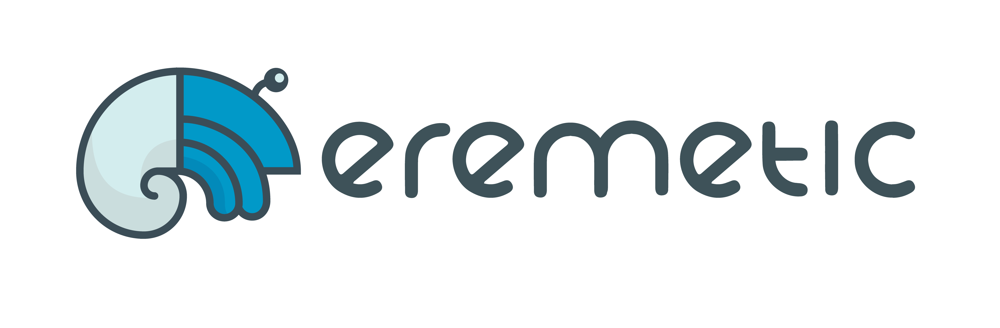

# 

[![Build Status][travis-image]](https://travis-ci.org/eremetic-framework/eremetic)
[![Coverage Status][coveralls-image]](https://coveralls.io/r/eremetic-framework/eremetic?branch=master)
[![Go Report][goreport-image]](https://goreportcard.com/report/github.com/eremetic-framework/eremetic)

## Purpose
Eremetic is a Mesos Framework to run one-shot tasks. The vision is to provide a
bridge between Applications that need to run tasks and Mesos. That way a developer
creating an application that needs to schedule tasks (such as cron) wouldn't need
to connect to Mesos directly.

## Usage
Send a cURL to the eremetic framework with how much cpu and memory you need, what docker image to run and which command to run with that image.

```bash
curl -H "Content-Type: application/json" \
     -X POST \
     -d '{"mem":22.0, "cpu":1.0, "image": "busybox", "command": "echo $(date)"}' \
     http://eremetic_server:8080/api/v1/task
```

These basic fields are required but you can also specify volumes, container names to mounts volumes from, ports, environment
variables, and URIs for the mesos fetcher to download. See
[examples.md](examples.md) for more examples on how to use eremetic.

JSON format:

```javascript
{
  // Float64, fractions of a CPU to request
  "cpu":      1.0,
  // Float64, memory to use (MiB)
  "mem":       22.0,
  // String, full tag or hash of container to run
  "image":   "busybox",
  // Boolean, if set to true, docker image will be pulled before each task launch
  "force_pull_image": false,
  // Boolean, if set to true, docker will run the container in 'privileged' mode giving it all capabilities
  "privileged": false,
  // String, command to run in the docker container
  "command": "echo $(date)",
  // Array of Strings, arguements to pass to the docker container entrypoint
  "args": ["+%s"],
  // Array of Objects, volumes to mount in the container
  "volumes": [
    {
      "container_path": "/var/run/docker.sock",
      "host_path": "/var/run/docker.sock"
    }
  ],
  // Array of Strings, container names to get volumes from
  "volumes_from": ["+%s"],
  //String, name of the task. If empty, Eremetic assigns a random task name   
  "name" : "Task Name",
  //String, network mode to pass to the container.
  "network" : "BRIDGE",
  //String, DNS address to be used by the container.
   "dns" : "172.0.0.2",
  // Array of Objects, ports to forward to the container.
  // Assigned host ports are available as environment variables (e.g. PORT0, PORT1 and so on with PORT being an alias for PORT0).
  "ports": [
    {
      "container_port": 80,
      "protocol": "tcp"
    }
  ],
  // Object, Environment variables to pass to the container
  "env": {
    "KEY": "value"
  },
  // Object, Will be merged to `env` when passed to Mesos, but masked when doing a GET.
  // See Clarification of the Masked Env field below for more information
  "masked_env": {
    "KEY": "value"
  },
  // Object, labels to be passed to the Mesos task
  "labels": {
    "KEY": "value"
  },  
  // URIs and attributes of resource to download. You need to explicitly define
  // `"extract"` to unarchive files.
  "fetch": [
    {
      "uri" : "http://server.local/another_resource",
      "extract": false,
      "executable": false,
      "cache": false
    }
  ],
  // Constraints for which agent the task can run on (beyond cpu/memory).
  // Matching is strict and only attributes are currently supported. If
  // multiple constraints exist, they are evaluated using AND (ie: all or none).
  "agent_constraints": [
      {
          "attribute_name": "aws-region",
          "attribute_value": "us-west-2"
      }
  ],
  // String, URL to post a callback to. Callback message has format:
  // {"time":1451398320,"status":"TASK_FAILED","task_id":"eremetic-task.79feb50d-3d36-47cf-98ff-a52ef2bc0eb5"}
  "callback_uri": "http://callback.local"
}
```

### Note
Most of this meta-data will not remain after a full restart of Eremetic.

### Clarification of the Masked Env field
The purpose of the field is to provide a way to pass along environment variables that you don't want to have exposed in a subsequent GET call.
It is not intended to provide full security, as someone with access to either the machine running Eremetic or the Mesos Agent that the task is being run on will still be able to view these values.
These values are not encrypted, but simply masked when retrieved back via the API.

For security purposes, ensure TLS (https) is being used for the Eremetic communication and that access to any machines is properly restricted.


## Configuration
create /etc/eremetic/eremetic.yml with:

    address: 0.0.0.0
    port: 8080
    master: zk://<zookeeper_node1:port>,<zookeeper_node2:port>,(...)/mesos
    messenger_address: <callback address for mesos>
    messenger_port: <port for mesos to communicate on>
    loglevel: DEBUG
    logformat: json
    queue_size: 100
    url_prefix: <prefix to shim relative URLs behind a reverse proxy>

## Database
Eremetic uses a database to store task information. The driver can be configured
by setting the `database_driver` value.

Allowed values are: `zk`, `boltdb`

The location of the database can be configured by setting the `database` value.

### BoltDB
The default database that will be used unless anything is configured.

The default value of the `database` field is `db/eremetic.db`

### ZooKeeper
If you use `zk` as a database driver, the `database` field must be provided as a
complete zk-uri (zk://zk1:1234,zk2:1234/my/database).

## Authentication
To enable mesos framework authentication add the location of credential file to your configuration:

    credential_file: /var/mesos_secret

The file should contain the Principal to authenticate and the secret separated by white space like so:

    principal    secret_key

## Building

### Environment
Clone the repository into `$GOPATH/src/github.com/eremetic-framework/eremetic`.
This is needed because of internal package dependencies

### Install dependencies
First you need to install dependencies. Parts of the eremetic code is auto-generated (assets and templates for the HTML view are compiled). In order for go generate to work, `go-bindata` and `go-bindata-assetfs` needs to be manually installed.

    curl https://bin.equinox.io/a/75VeNN6mcnk/github-com-kevinburke-go-bindata-go-bindata-linux-amd64.tar.gz | tar xvf - -C /usr/local/bin
    go get github.com/elazarl/go-bindata-assetfs/...

All other dependencies are vendored, so it is recommended to run eremetic with Go >= 1.6 or with GO15VENDOREXPERIMENT=1

### Creating the docker image
To build a docker image with eremetic, simply run

    make docker

### Compiling
Run `make eremetic`

## Running on mesos

Eremetic can itself be run on mesos using e.g marathon. An
[example configuration](misc/eremetic.json) for marathon is provided that is
ready to be submitted through the api.

```bash
curl -X POST -H 'Content-Type: application/json' $MARATHON/v2/apps -d@misc/eremetic.json
```

## Running tests
The default target of make builds and runs tests.
Tests can also be run by running `goconvey` in the project root.

## Running with minimesos
Using [minimesos](https://www.minimesos.org/) is a very simple way to test and play with eremetic.

```bash
docker run -e MASTER=$MINIMESOS_ZOOKEEPER -e HOST=0.0.0.0 -e DATABASE_DRIVER=zk -e DATABASE=$MINIMESOS_ZOOKEEPER/eremetic -e PORT=8000 -p 8000:8000 alde/eremetic:latest
```

## hermit CLI

[hermit](cmd/hermit) is a command-line application to perform operations on a Eremetic server from the terminal.

## Contributors

These are the fine folks who helped build eremetic

- Rickard Dybeck
- David Keijser
- Aidan McGinley
- William Strucke
- Charles G.
- Clément Laforet
- Marcus Olsson
- Rares Mirica

## Acknowledgements
Thanks to Sebastian Norde for the awesome logo!

## Licensing
Apache-2

[travis-image]: https://img.shields.io/travis/eremetic-framework/eremetic.svg?style=flat
[coveralls-image]: https://img.shields.io/coveralls/eremetic-framework/eremetic.svg?style=flat
[goreport-image]: https://goreportcard.com/badge/github.com/eremetic-framework/eremetic
